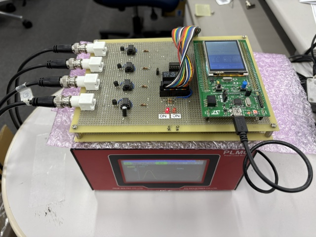
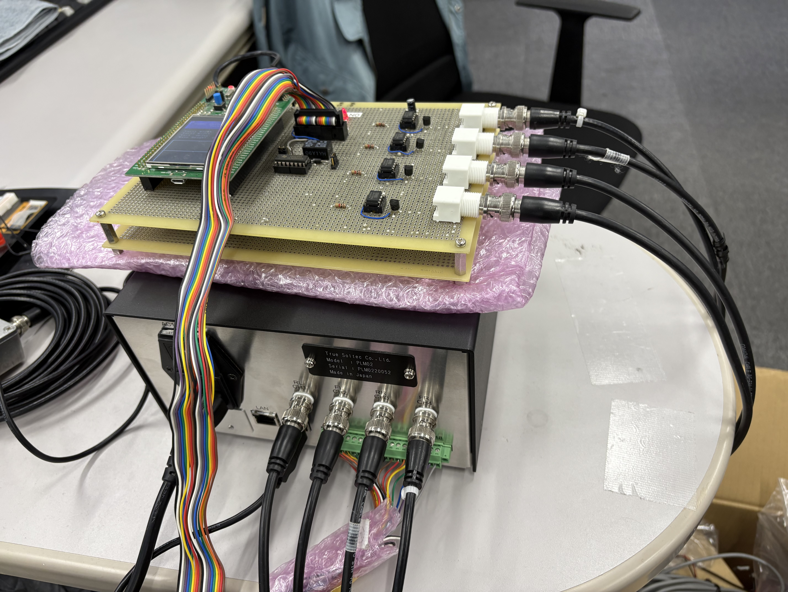
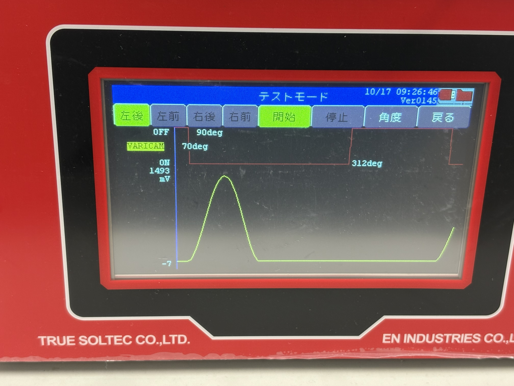
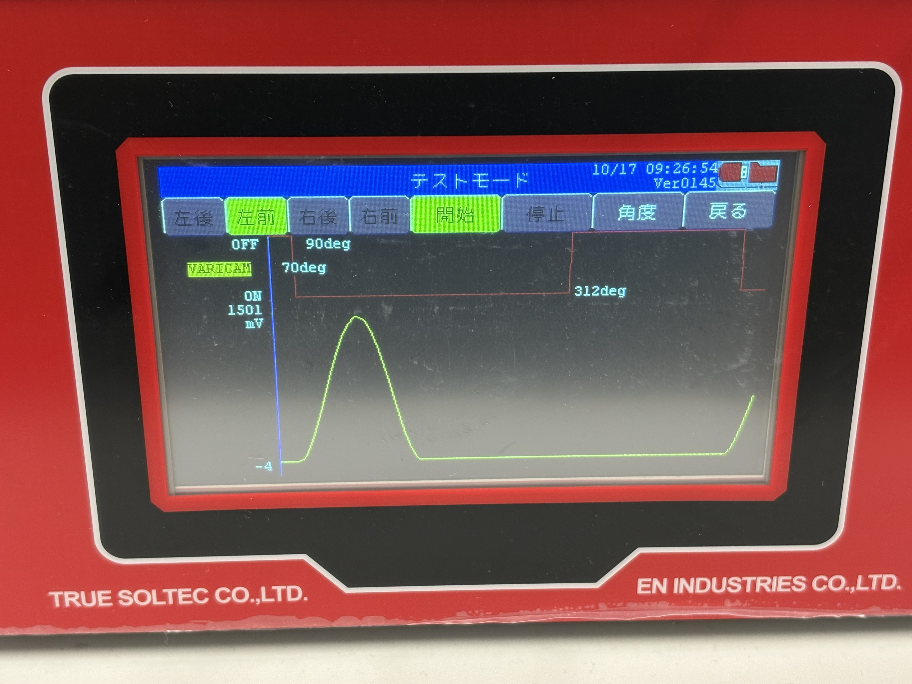
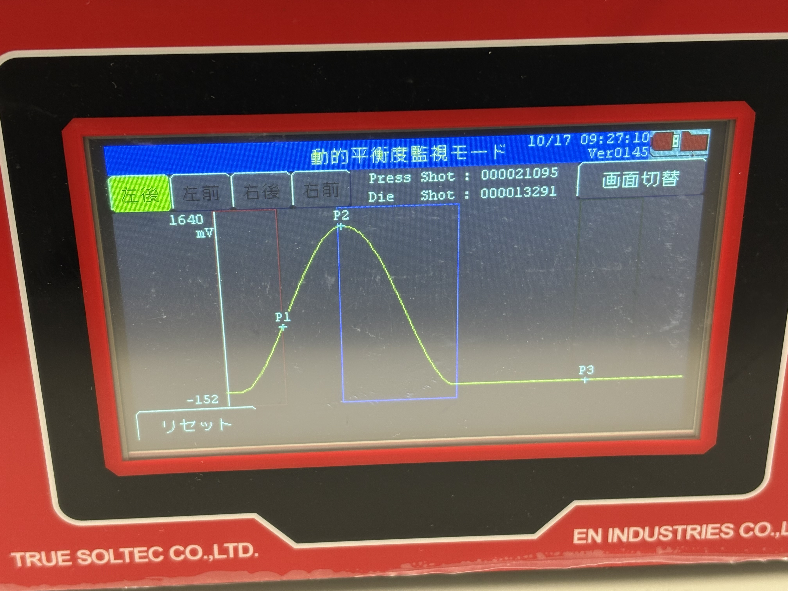
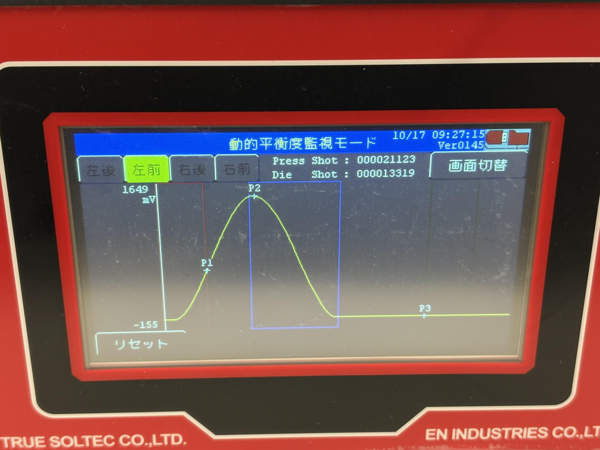
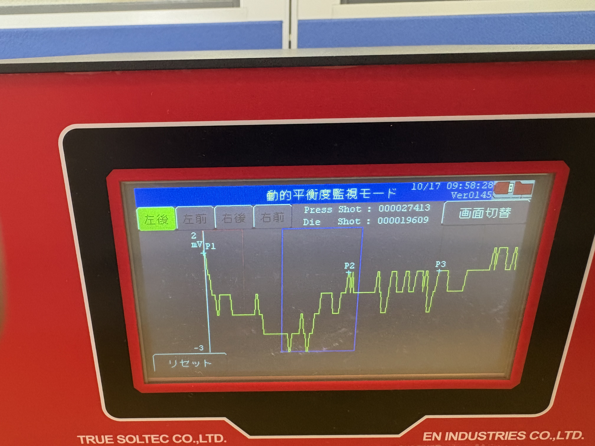
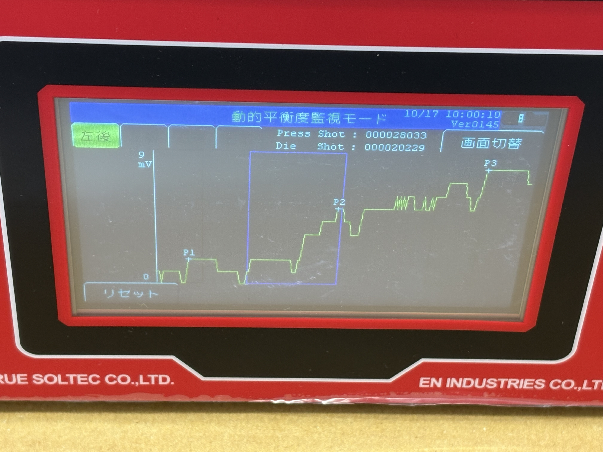

# 🗓 作業履歴メモ

## 📅 日付
- 2025-10-17 08:40:48

---

## 🧩 作業内容
1. PLM02FW(住友津納品分)の動作チェック
2. EFMX2PCのセットアップをInnoSetupで作成する
3. TS-DCA1の残作業の再開

---

## 🧠 気づき・問題点
1. PLM02FWの動作チェック
### 出荷検査ジグで動作確認をした。→ バリカム・センサともに正常に動作した  以下正常動作画像を添付（6枚）
  
   - テスト環境画像１  
  
   - テスト環境画像２  
  
   - 動作結果画像１・・・通常環境ではOK  
  
   - 動作結果画像２・・・通常環境ではOK  
  
   - 動作結果画像３・・・通常環境ではOK  
  
   - 動作結果画像４・・・通常環境ではOK  
  

### 電源にノイズ発生機を接続し動作させた（マイナス側にノイズ）
  通常の波形を取り込めていない画像になった（2枚）
   - 電源ノイズ発生→動作結果画像１・・・ノイズ環境ではNG  
  
   - 電源ノイズ発生→動作結果画像２・・・ノイズ環境ではNG  
  

旧ロットではCOSELの電源ユニットを使用していたが（DEMO機）、出荷機からはCOSEL以外のものを使用している。（生産停止のため）  
COSELだと±2kVの電源ノイズでも、波形上にノイズが乗る程度だが、現在電源ユニットだとマイナス側ノイズに特に弱いようだ。  

2. EFMX2PCのセットアップをInnoSetupで作成しテスト依頼行った。（渡辺氏）

---

## 🛠 対応・検討メモ
- 
- 

---

## ✅ TODO・次回対応
- [ ] 
- [ ] 

---

## 📎 参考資料・リンク
- 
